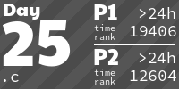

# Advent of Code
Advent of Code solutions

Mainly written to learn different languages.  Actual solution algorithms may not be my own but should have a comment linking to where I sourced them.

<!-- AOC TILES BEGIN -->
<h1 align="center">
  2023 - 50 ⭐
</h1>

<h1 align="center">
  2022 - 50 ⭐
</h1>

<!-- AOC TILES END -->

